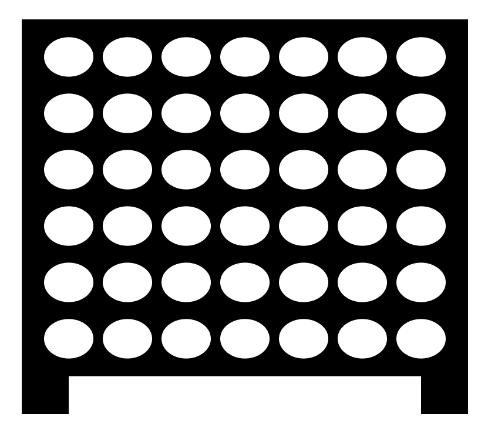
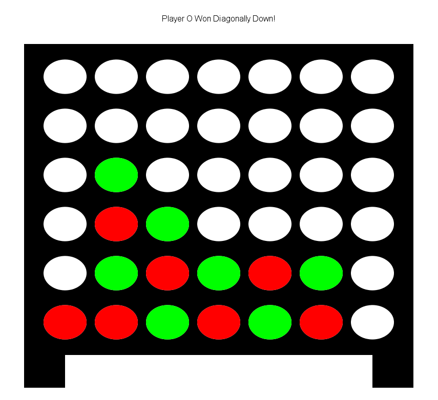

# Connect Four
## Introduction
Hello! This was a Connect Four game I made awhile ago while I was messing around with the StdDraw library which can be
found here: https://introcs.cs.princeton.edu/java/stdlib/StdDraw.java.html
## The UI
The UI is relatively straightforward. It is composed of 7 x 6 grid of cells where one can "drop" their disc into a
column. Clicking in the area of a column will drop the current player's disc. Then, the next player will take their 
turn. The first person to get four discs in a row either vertically, horizontally, or diagonally, will win the game.

Here is the result of the green player winning diagonally.

## To Run
    java ConnectFour